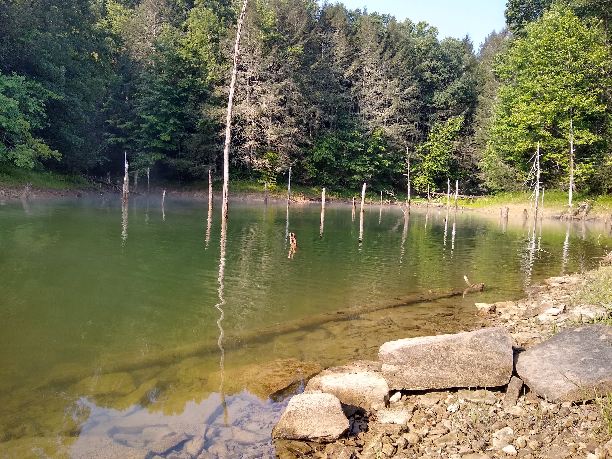
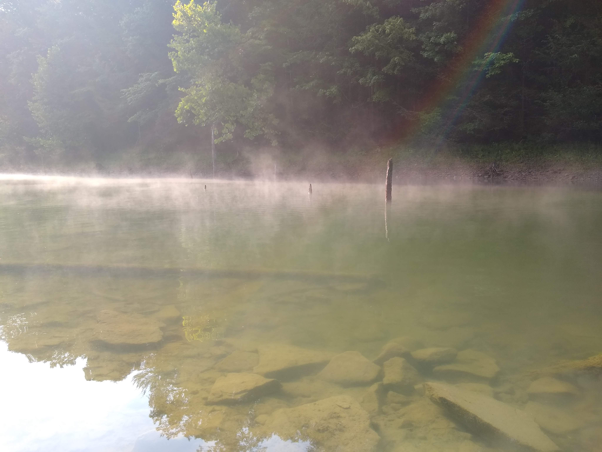
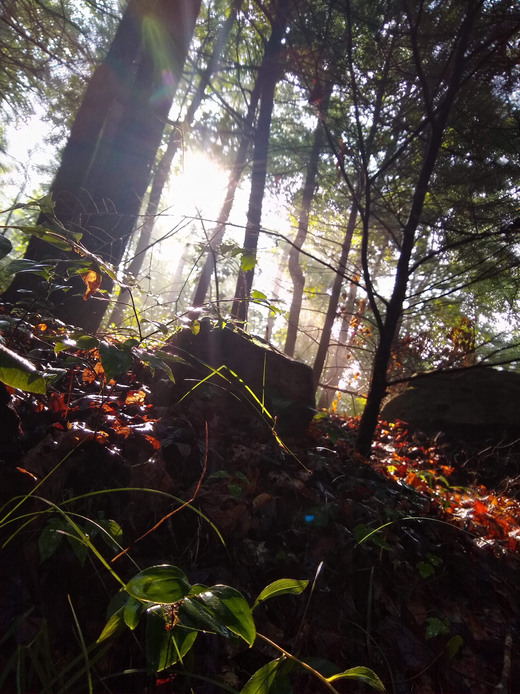
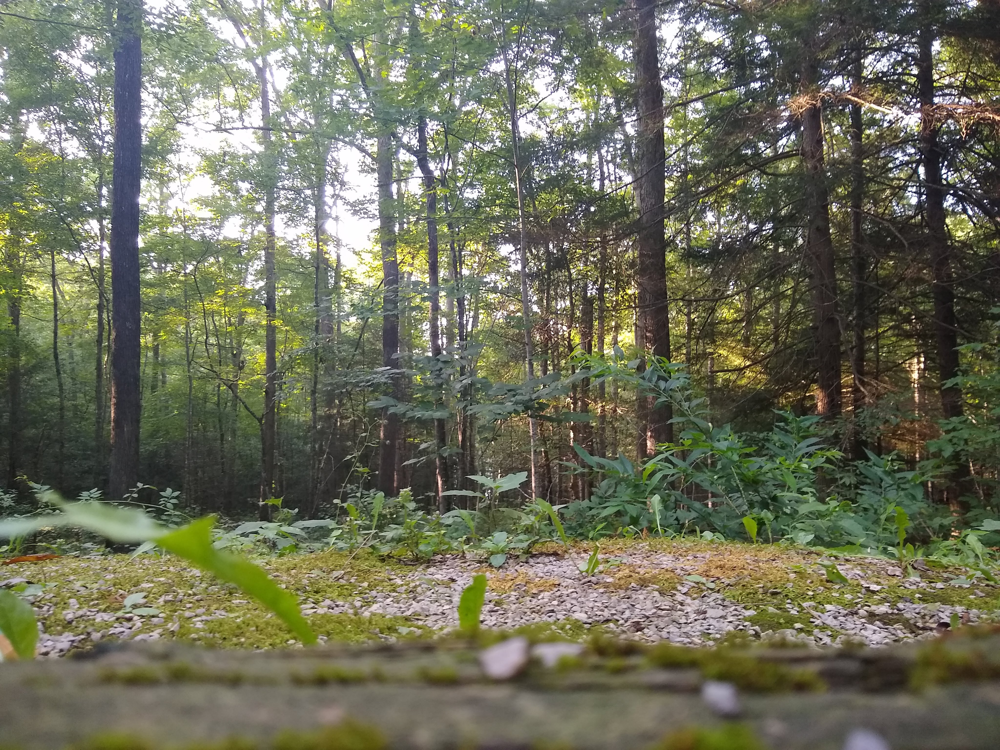

# Twin Knobs Campground/Beach
## Located at Cave Run Lake in the Daniel Boone National Forest (Winchester, KY)

Twin Knobs is a recreation area featuring nearly 200 camping areas, stretches of inland beaches, scenic foot trails, and a multitude of natural features associated with the Appalachian Mountains. The lake that borders it, Cave Run Lake, is a man-made body of water built by the U.S. Army Corps of Engineers to serve as flood protection for the Licking Valley. It also serves many other fuctions, including improving the Licking River's waterflow, providing a reservoir of fresh water for nearby communities, and providing habitats for several fish and wildlife species.

     
*Top-down visualization of Twin Knobs Campground/Beach*

[Link to georeferenced PDF](images/M7_Twin_Knobs_georef.pdf) 

## Photos of Twin Knobs & Cave Run Lake
     
*Secluded cove filled with broken trees in Cave Run Lake*

     
*Misty morning in the secluded cove*

     
*Snapshot of nature on one of Twin Knobs's scenic foot paths*

     
*The forest behind a camping site*

DEM and NAIP imagery data was obtained from KyFromAbove, hydrology data was obtained from USGS, and information about Twin Knobs was obtained from [Recreation.gov](https://www.recreation.gov/camping/campgrounds/233782?tab=info) and the [USDA Forest Service](https://www.fs.usda.gov/recarea/dbnf/recarea/?recid=39324). All data was analyzed and stylized in ArcGIS Pro and Belnder.

This map was created by Dilni Abeyrathne [@DTAbeyrathne](https://github.com/DTAbeyrathne) for the GEO409-001 (Spring 2023) class in the University of Kentucky’s Department of Geography. This webpage visualization was published on April 16th, 2023.