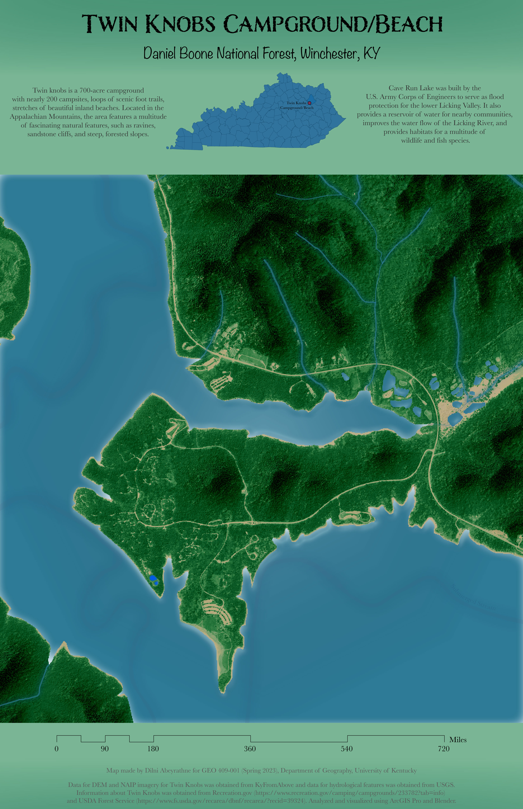

# twin knobs campground/beach
## Located at Cave Run Lake in the Daniel Boone National Forest (Winchester, KY)

Twin Knobs is a recreation area featuring nearly 200 camping areas, stretches of inland beaches, scenic foot trails, and a multitude of natural features associated with the Appalachian Mountains. The lake that borders it, Cave Run Lake, is a man-made body of water built by the U.S. Army Corps of Engineers to serve as flood protection for the Licking River Valley. It also serves many other fuctions, including improving the Licking River's waterflow, providing a reservoir of fresh water for nearby communities, and providing habitats for several fish and wildlife species.

     
*Top-down visualization of Twin Knobs Campground/Beach*

[Link to high-resolution version](M7_TwinKnobs_georef.pdf)     

This map was created by Dilni Abeyrathne [@DTAbeyrathne](https://github.com/DTAbeyrathne) for the GEO409-001 (Spring 2023) class in the University of Kentucky’s Department of Geography. This webpage visualization was published on April 16th, 2023.